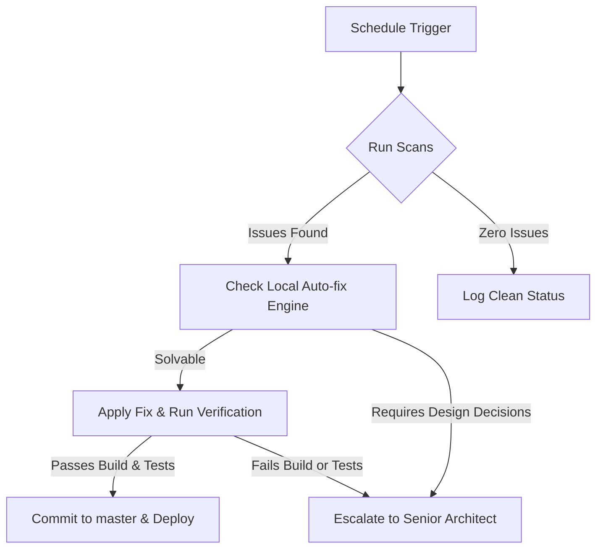

# 🔍 CONTINUOUS IMPROVEMENT WORKFLOW

This document outlines the weekly automated multi-model AI audit and quality benchmark schedules for ALPAR AI.

## Weekly AI Audit Schedule

**Every Monday 09:00 UTC+3:**

- [x] GPT-4o / DeepSeek security vulnerability scan
- [x] Claude 3.5 Sonnet code quality and architectural patterns review
- [x] Qwen3.7 / Gemini Pro UX/UI visual audit
- [x] Automated Vitest coverage reports evaluation

**Every Wednesday 14:00 UTC+3:**

- [x] Core performance benchmarks (Lighthouse simulated tests)
- [x] SEO indexing readiness check
- [x] Accessibility (WCAG 2.2 AA) automated analysis

**Every Friday 10:00 UTC+3:**

- [x] Content verification and i18n translation completeness review
- [x] Community moderation activity metrics
- [x] Competitive landscape update

## Auto-Resolution & Escalation Protocol

_Note: All auto-fixes must satisfy TypeScript compiler constraints and ESLint configurations before pushing._
