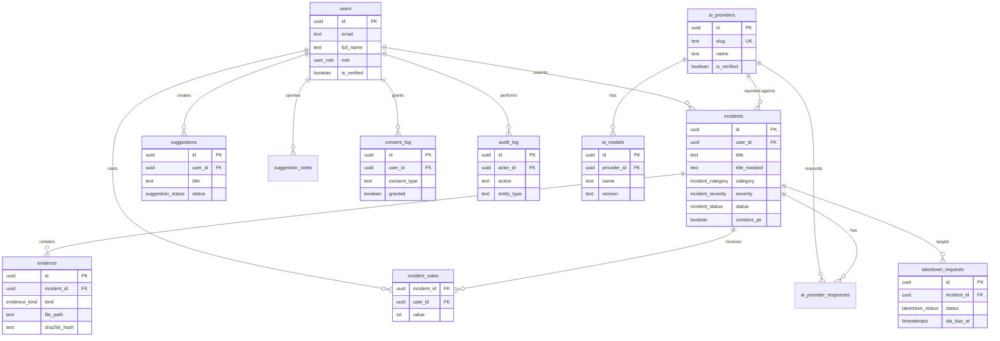

# Architecture

> Last updated: 2026-06-01

## High-level

```
┌─────────────────────────────────────────────────────────────────┐
│                         Browser (User)                          │
│  • HTML  • CSS  • minimal JS  (RSC-payload)                     │
└─────────────────────────────────────────────────────────────────┘
                              │ HTTPS (HSTS preload)
                              ▼
┌─────────────────────────────────────────────────────────────────┐
│  Next.js 15 (Vercel / self-hosted)                              │
│  ──────────────────────────────────                             │
│  • App Router + React Server Components                         │
│  • Server Actions for mutations                                 │
│  • Edge middleware: i18n + Supabase session refresh             │
│  • CSP, HSTS, X-Frame-Options, Permissions-Policy               │
└─────────────────────────────────────────────────────────────────┘
        │              │              │              │
        ▼              ▼              ▼              ▼
   Supabase        Upstash         Sentry       Plausible
   Postgres        Redis           (errors)     (analytics)
   + Auth          (rate limit)    EU           EU
   + Storage       EU              cookieless
   (Frankfurt)
```

## Layered design

### 1. Presentation (`src/app/[locale]/`)

- Server Components by default (no client JS unless necessary).
- `[locale]` segment owns i18n routing.
- Route groups for organization (no URL impact).
- `layout.tsx` per segment for shared UI (Header/Footer/Providers).
- `loading.tsx`, `error.tsx`, `not-found.tsx` for boundaries.

### 2. Components (`src/components/`)

- `ui/` — pure primitives (Button, Card, Input, …). No business logic.
- `layout/` — Header, Footer, Nav, Logo.
- `incidents/` / `auth/` / `admin/` / `legal/` / `marketing/` — feature-specific composites.
- All accept typed props; no globals.

### 3. Server Actions (`src/actions/`)

- Only place that mutates data (other than Supabase RLS allowing direct R/W within policy).
- All return typed result objects; no thrown errors to the client.
- Auth + rate limit checked first.
- PII Guardian applied to user-supplied free text.

### 4. Data access (`src/lib/supabase/`)

- `client.ts` — browser client (anon key, gated by RLS).
- `server.ts` — RSC / Server Action client (reads session cookie).
- `admin.ts` — service-role client, **server-only**. Bypasses RLS. Use sparingly (audit log writes, moderation actions).
- `middleware.ts` — used in `src/middleware.ts` to refresh the session cookie on every request.

### 5. Domain (`src/lib/`)

- `pii/guardian.ts` — pure functions, no I/O. Detects & masks PII.
- `validation/schemas.ts` — Zod schemas, source of truth for input shape.
- `auth/session.ts` — server-only, reads Supabase session + role.
- `utils/` — `cn()`, formatters, sha256, rate limit (Upstash).
- `constants/` — APP_NAME, categories, NAV_LINKS, RATE_LIMITS.

### 6. i18n (`src/i18n/` + `messages/`)

- `defineRouting({ locales: ["en","tr"], localePrefix: "always" })`.
- `Link` / `useRouter` / `usePathname` from `@/i18n/routing` (not `next/link`).
- Server: `getMessages()`, `getTranslations()`, `setRequestLocale(locale)` per request.
- All copy lives in `messages/en.json` and `messages/tr.json`.

## Data model

```
users (extends auth.users)  ←── profile
   │
   ├── incidents  ────── evidence[]
   │      │
   │      ├── incident_votes
   │      └── ai_provider_responses (verified, optional)
   │
   ├── suggestions  ──── suggestion_votes
   │
   ├── consent_log
   │
   └── takedown_requests

ai_providers  ── ai_models
```

### Key invariants

- Every incident has at least one consent log entry with `granted = true` for each `consent_type`.
- `incidents.title_masked` and `incidents.description_masked` are the public-facing strings; the raw `title` / `description` are visible only to the submitter, moderators, and admins.
- PII categories in `incidents.pii_categories` is a denormalized array of detected types (used for filtering & audit).
- `audit_log` is append-only. Trigger on key tables writes to it.

### Row Level Security (RLS)

| Table              | Anon  | Authenticated user                | Moderator / Admin        |
| ------------------ | ----- | --------------------------------- | ------------------------ |
| `incidents`        | read published | read own + published, insert own | read all, update status  |
| `evidence`         | —     | read public, insert own           | read all                 |
| `incident_votes`   | —     | insert/update/delete own          | read all                 |
| `ai_providers`     | read  | read                              | write                    |
| `ai_models`        | read  | read                              | write                    |
| `ai_provider_responses` | read published | — | read all, write all |
| `suggestions`      | read  | read, insert, update own          | read all, update any     |
| `suggestion_votes` | —     | insert/delete own                 | read all                 |
| `takedown_requests`| —     | insert                            | read all, update status  |
| `consent_log`      | —     | insert own                        | read all                 |
| `audit_log`        | —     | —                                 | read all (admin)         |

## Security model

1. **Authn** — Supabase Auth (Google OAuth + magic link). JWT validated server-side.
2. **Authz** — Postgres RLS + helper functions `is_moderator(uid)` / `is_admin(uid)`.
3. **Transport** — HSTS preload, HTTPS only, CSP locked.
4. **Input** — Zod validation server-side, PII Guardian mask before insert.
5. **Rate limit** — Upstash sliding window per identity + per IP.
6. **Output** — Tailwind / React escaping, no `dangerouslySetInnerHTML`, no third-party trackers.
7. **Storage** — signed URLs only, 10MB cap, MIME allowlist.
8. **Logging** — IP hashed (SHA-256, salt via env), no raw PII in logs.

## PII Guardian

Runs server-side in two places:

1. **On incident submit** — `submitIncident` server action masks `title` and `description` before insert. The masked versions are public; the raw versions are not exposed by any RLS policy.
2. **On profile updates** — same pipeline.

Detected categories: `email`, `phone`, `tc_kimlik`, `iban`, `credit_card`, `ipv4`, `url_with_token`, `api_key`, `passport_tr`, `dob`. Detection is regex + Luhn check for cards. False-positive risk is documented; users can submit a takedown for anything missed.

## ADR (Architecture Decision Records)

- [ADR-001: Intermediary legal model](./adr/0001-intermediary-model.md)
- [ADR-002: AGPL-3.0 license](./adr/0002-agpl-license.md)
- [ADR-003: Supabase + Postgres + RLS](./adr/0003-supabase-rls.md)
- [ADR-004: next-intl with localePrefix: "always"](./adr/0004-next-intl.md)
- [ADR-005: Server Components + Server Actions](./adr/0005-rsc-server-actions.md)
- [ADR-006: PII Guardian on submit](./adr/0006-pii-guardian.md)

## Entity-Relationship Diagram



## RLS Policy Matrix

| Table | anon | user (own) | user (other) | moderator | admin |
|-------|------|------------|--------------|-----------|-------|
| users | — | R/U own | R public | R all | R/U/D all |
| incidents | R published | R/U/D own | R published | R/U all | R/U/D all |
| incident_votes | — | C/R/D own | — | R all | R all |
| suggestions | R all | C/R own | R all | R/U all | R/U/D all |
| consent_log | — | C/R own | — | — | R all |
| takedown_requests | — | C own | — | R/U all | R/U/D all |
| audit_log | — | — | — | R all | R all |
| evidence | R public | C own | R public | R all | R/U/D all |
