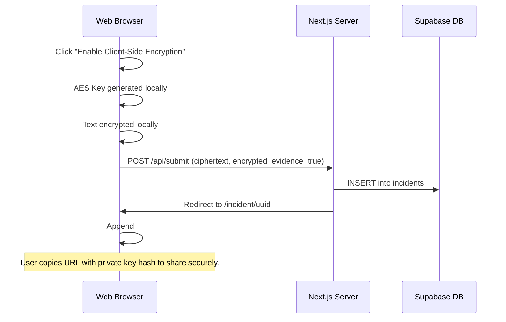

# ZK1 - Zero-Knowledge Evidence Encryption Design

This document describes the technical architecture and encryption specifications for the optional Client-Side Zero-Knowledge (ZK) encryption feature in ALPAR AI.

## 1. Cryptographic Specifications

- **Algorithm:** AES-256-GCM (Galois/Counter Mode).
- **Key Generation:** Client-side cryptographically secure pseudo-random number generator (CSPRNG) generating a 256-bit key.
- **Initialization Vector (IV):** 12-byte (96-bit) unique IV generated per encryption event.
- **Key Storage:** The key is **NEVER** sent to or stored on the server. It is returned to the user and appended as a URI fragment identifier (e.g., `https://alparai.com/incident/uuid#key=HEX_ENCODED_KEY`). Because fragment identifiers (`#...`) are not sent to the server in HTTP requests, key privacy is guaranteed.
- **Data Storage:**
  - `encrypted_evidence`: `true`
  - `evidence_ciphertext`: Base64 encoded string combining the IV + ciphertext + GCM auth tag.

## 2. SubtleCrypto Round-Trip Helper

Here is the core client-side Javascript implementation using the web browser's native `window.crypto.subtle` API:

```javascript
// Helper to convert array buffer to base64
function bufferToBase64(buf) {
  return btoa(String.fromCharCode(...new Uint8Array(buf)));
}

// Helper to convert base64 to array buffer
function base64ToBuffer(base64) {
  return Uint8Array.from(atob(base64), (c) => c.charCodeAt(0));
}

// 1. Client-Side Encryption
async function encryptEvidence(plainText) {
  const key = await window.crypto.subtle.generateKey({ name: "AES-GCM", length: 256 }, true, [
    "encrypt",
    "decrypt",
  ]);

  const iv = window.crypto.getRandomValues(new Uint8Array(12));
  const encoded = new TextEncoder().encode(plainText);

  const ciphertext = await window.crypto.subtle.encrypt({ name: "AES-GCM", iv: iv }, key, encoded);

  const exportedKey = await window.crypto.subtle.exportKey("raw", key);
  const keyHex = Array.from(new Uint8Array(exportedKey))
    .map((b) => b.toString(16).padStart(2, "0"))
    .join("");

  // Combine IV and Ciphertext
  const combined = new Uint8Array(iv.length + ciphertext.byteLength);
  combined.set(iv, 0);
  combined.set(new Uint8Array(ciphertext), iv.length);

  return {
    ciphertext: bufferToBase64(combined),
    keyHex: keyHex,
  };
}

// 2. Client-Side Decryption
async function decryptEvidence(combinedBase64, keyHex) {
  const combined = base64ToBuffer(combinedBase64);
  const iv = combined.slice(0, 12);
  const ciphertext = combined.slice(12);

  const keyBuffer = new Uint8Array(keyHex.match(/.{1,2}/g).map((byte) => parseInt(byte, 16)));
  const key = await window.crypto.subtle.importKey("raw", keyBuffer, "AES-GCM", true, ["decrypt"]);

  const decrypted = await window.crypto.subtle.decrypt(
    { name: "AES-GCM", iv: iv },
    key,
    ciphertext,
  );

  return new TextDecoder().decode(decrypted);
}
```

## 3. UI/UX Interaction Diagram


