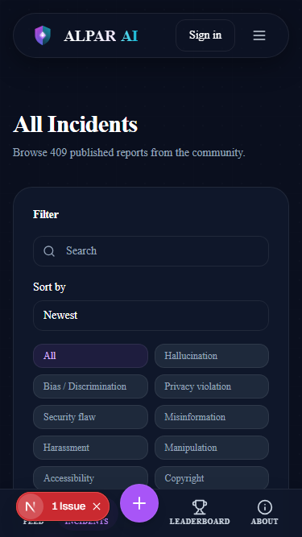
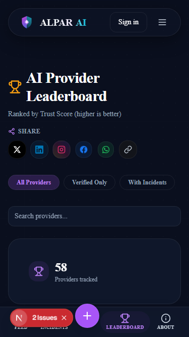
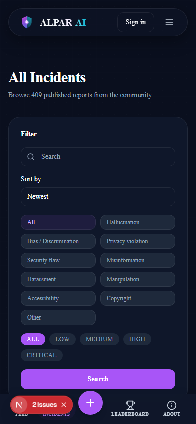
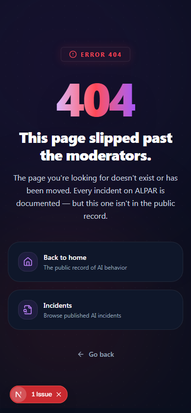
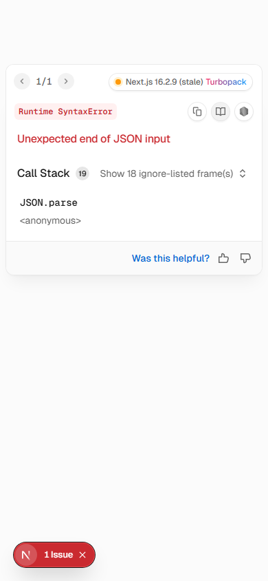
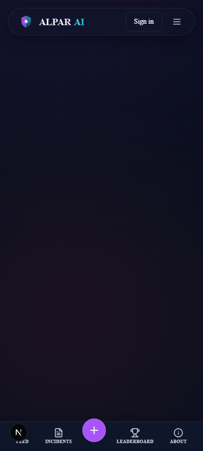
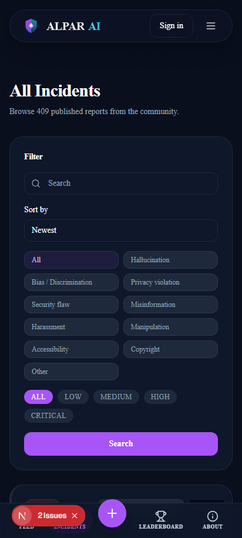
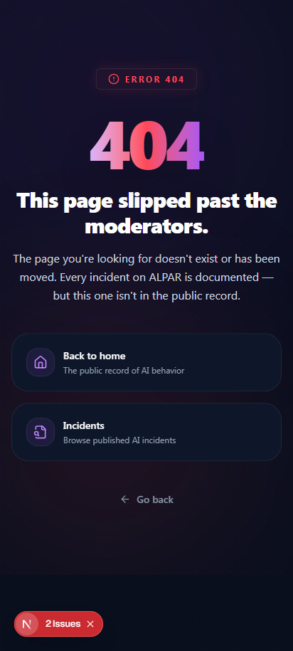
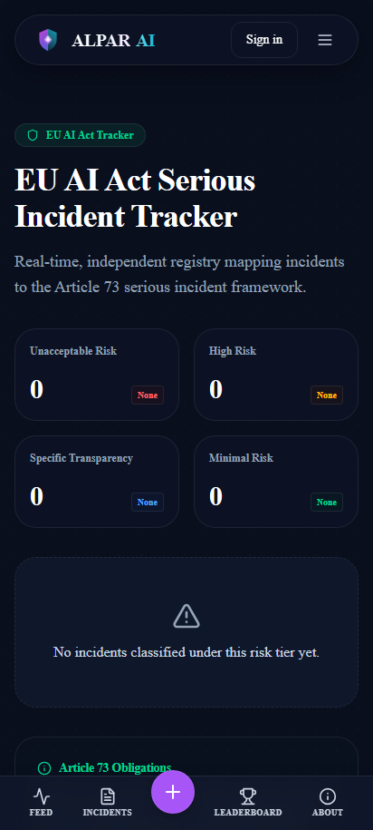
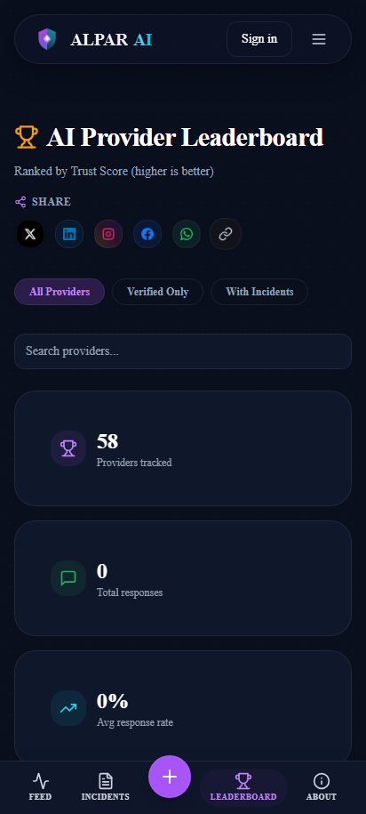

# Mobile Quality Audit Report

*Generated on: 2026-07-10T18:58:24.268Z*

| Page | Viewport | Issue(s) | Severity | Screenshot |
|------|----------|----------|----------|------------|
| home | 375x667 (iPhone_SE) | Horizontal Overflow (scrollWidth: 389px vs viewport: 375px) [Elements: div.bg-brand-600/8, div.bg-warning-500/15, div.flex] | Small Touch Targets (78 elements < 44px) | High |  |
| incidents | 375x667 (iPhone_SE) | Small Touch Targets (126 elements < 44px) | Low |  |
| incident_detail | 375x667 (iPhone_SE) | Small Touch Targets (1 elements < 44px) | Low |  |
| submit | 375x667 (iPhone_SE) | Small Touch Targets (48 elements < 44px) | Low |  |
| ai-act | 375x667 (iPhone_SE) | Small Touch Targets (32 elements < 44px) | Low |  |
| transparency | 375x667 (iPhone_SE) | Small Touch Targets (32 elements < 44px) | Low |  |
| leaderboard | 375x667 (iPhone_SE) | Small Touch Targets (126 elements < 44px) | Low |  |
| academy | 375x667 (iPhone_SE) | Small Touch Targets (38 elements < 44px) | Low |  |
| blog | 375x667 (iPhone_SE) | Small Touch Targets (38 elements < 44px) | Low |  |
| unsubscribe | 375x667 (iPhone_SE) | Small Touch Targets (33 elements < 44px) | Low |  |
| home | 390x844 (iPhone_14) | Horizontal Overflow (scrollWidth: 404px vs viewport: 390px) [Elements: div.bg-brand-600/8, div.bg-warning-500/15, div.flex] | Small Touch Targets (78 elements < 44px) | High |  |
| incidents | 390x844 (iPhone_14) | Small Touch Targets (126 elements < 44px) | Low |  |
| incident_detail | 390x844 (iPhone_14) | Small Touch Targets (1 elements < 44px) | Low |  |
| submit | 390x844 (iPhone_14) | Small Touch Targets (48 elements < 44px) | Low |  |
| ai-act | 390x844 (iPhone_14) | Small Touch Targets (32 elements < 44px) | Low |  |
| transparency | 390x844 (iPhone_14) | Small Touch Targets (32 elements < 44px) | Low |  |
| leaderboard | 390x844 (iPhone_14) | Small Touch Targets (126 elements < 44px) | Low |  |
| academy | 390x844 (iPhone_14) | Small Touch Targets (38 elements < 44px) | Low |  |
| blog | 390x844 (iPhone_14) | Small Touch Targets (38 elements < 44px) | Low |  |
| unsubscribe | 390x844 (iPhone_14) | Small Touch Targets (33 elements < 44px) | Low |  |
| home | 412x915 (Pixel_7) | Horizontal Overflow (scrollWidth: 426px vs viewport: 412px) [Elements: div.bg-brand-600/8, div.bg-warning-500/15, div.flex] | Small Touch Targets (78 elements < 44px) | High |  |
| incidents | 412x915 (Pixel_7) | Small Touch Targets (126 elements < 44px) | Low |  |
| incident_detail | 412x915 (Pixel_7) | Small Touch Targets (1 elements < 44px) | Low |  |
| submit | 412x915 (Pixel_7) | Small Touch Targets (48 elements < 44px) | Low |  |
| ai-act | 412x915 (Pixel_7) | Small Touch Targets (32 elements < 44px) | Low |  |
| transparency | 412x915 (Pixel_7) | Small Touch Targets (32 elements < 44px) | Low |  |
| leaderboard | 412x915 (Pixel_7) | Small Touch Targets (126 elements < 44px) | Low |  |
| academy | 412x915 (Pixel_7) | Small Touch Targets (38 elements < 44px) | Low |  |
| blog | 412x915 (Pixel_7) | Small Touch Targets (38 elements < 44px) | Low |  |
| unsubscribe | 412x915 (Pixel_7) | Small Touch Targets (33 elements < 44px) | Low |  |
