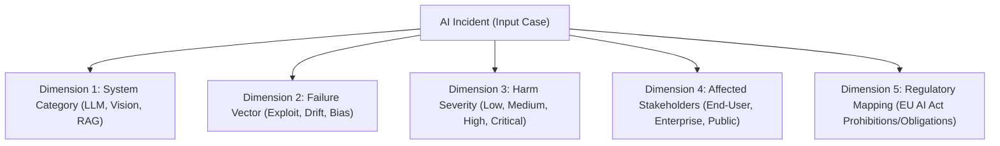

# N3 Standards Contribution — ISO/IEC & CEN-CENELEC Working Draft

**Document Type:** Technical Contribution / Working Draft Proposal  
**Target Committees:** ISO/IEC JTC 1/SC 42 (Artificial Intelligence) & CEN-CENELEC JTC 21 (AI Standards)  
**Subject:** Proposal for a Standardized AI Incident Taxonomy and Crowdsourced Vulnerability Registry Integration

---

## 1. Scope & Objective

This contribution proposes a multi-dimensional, empirical taxonomy for documenting, classifying, and reporting real-world AI incidents, failures, and safety exploits. By leveraging the **ALPAR AI Incident Taxonomy**, international standards bodies can establish a unified framework for cross-border incident reporting and algorithmic audits.

---

## 2. The ALPAR AI Incident Taxonomy Framework

AI incidents are classified across five distinct dimensions to capture technical, societal, and regulatory impacts:

### 2.1 Dimension Details:

1. **System Topology:** Categorizes the underlying model architecture (e.g., Large Language Model, Text-to-Video, Multi-modal foundation models).
2. **Exploit Vector:** Identifies the mechanism of failure (e.g., Indirect Prompt Injection, Data Poisoning, System Prompt Leak, Output Hallucination).
3. **Severity Assessment:** Wilson-score based confidence scoring of impact (Critical, High, Medium, Low).
4. **Regulatory Obligation Mapping:** Direct mapping to the EU AI Act (e.g., Article 52 Transparency Obligation compliance, Article 5 Prohibited practices audit).

---

## 3. Proposal for Standards Integration

### 3.1 Establishing Crowdsourced Threat Registries (CEN-CENELEC JTC 21)

We propose that European AI Act compliance registries incorporate open, crowdsourced verification protocols (similar to ALPAR AI’s peer-reviewed advisory and expert network) to accelerate the identification of systemic risks before foundation models achieve widespread deployment.

### 3.2 Standardizing Verification Confidence Intervals (ISO/IEC JTC 1/SC 42)

Standardized incident databases should utilize statistical confidence metrics (such as the Wilson score interval calculated under ALPAR's K-BENCHMARK) rather than simple raw vote counts. This prevents malicious manipulation of rating scores by interested parties.

---

## 4. Submission & Contact Details

- **Submitter:** ALPAR AI Foundation
- **Representative:** Ercümend Alpar
- **Contact:** *quantum.matrix.core@gmail.com*
- **Status:** Draft Proposal for Working Group Review
