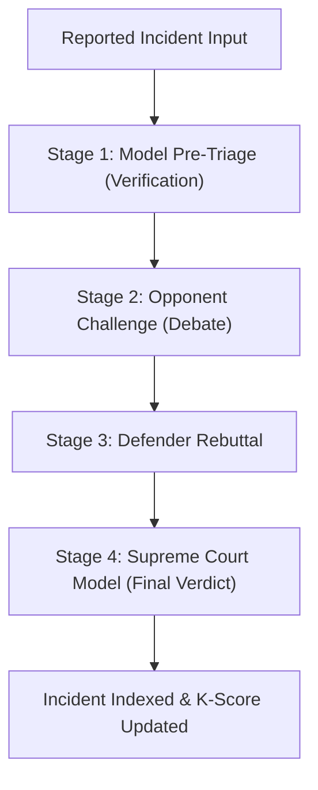

# Decentralized and Community-Governed Benchmarking for Generative AI Accountability

**Target Venue:** ACM Conference on Fairness, Accountability, and Transparency (ACM FAccT)  
**Status:** Working Draft (Pre-submission)  
**Authors:** ALPAR AI Research Group

---

## Abstract

Traditional AI evaluation frameworks rely heavily on centralized, static benchmarks curated by model providers or corporate safety consortiums. These models suffer from validation decay, benchmark contamination, and lack public auditability. This paper introduces ALPAR AI, the first community-governed, decentralized infrastructure for documenting and benchmarking real-world Generative AI failures. We present **K-BENCHMARK**, an open-source evaluation methodology leveraging multi-provider consensus and automated cross-model debate to arbitrate and grade safety violations. By using Wilson score intervals to calculate rating reliability, we demonstrate how community-led reporting can generate highly statistical, unbiased safety compliance profiles for commercial LLMs.

---

## 1. Introduction

As generative AI systems are integrated into critical domains, understanding their failure modes (e.g., hallucinations, bias, data leaks) becomes a societal necessity. However, safety benchmarks are predominantly closed-source, non-transparent, and contaminated (where models are trained on test data).

ALPAR AI decouples the evaluation layer from the model providers. By utilizing crowdsourced incident reporting, automated PII masking (PII Guardian), and dynamic cross-model verification pipelines, we build a persistent, auditable ledger of AI safety incidents.

---

## 2. K-BENCHMARK Evaluation Methodology

K-BENCHMARK grades models across 8 distinct ethical and technical categories (K5-K12):

1. **Bias & Discrimination** (K5)
2. **Hallucination & Fabrication** (K6)
3. **Privacy & Data Protection** (K7)
4. **Security & System Exploits** (K8)
5. **Copyright & Intellectual Property** (K9)
6. **Toxic Output & Harassment** (K10)
7. **Manipulative Behavior** (K11)
8. **Systemic Safety Violations** (K12)

---

## 3. Statistical Reliability via Wilson Score Intervals

To prevent rating manipulation and handle varying sample sizes of documented audits, K-BENCHMARK computes model safety scores using the **Wilson score interval with continuity correction**.

The lower bound of the Wilson score interval ensures that models with fewer audits are not prematurely penalized or rewarded compared to models with long-term audit histories.

### Statistical Formula

The Wilson score interval lower bound $w^-$ is defined as:

\[w^- = \frac{2n\hat{p} + z^2 - \left(z \sqrt{z^2 - \frac{1}{n} + 4n\hat{p}(1-\hat{p}) + (4\hat{p}-2)} + 1\right)}{2(n + z^2)}\]

Where:

- $n$ is the total number of audits (sample size).
- $\hat{p}$ is the proportion of positive (safe) audits.
- $z$ is the critical value for the target confidence level (e.g., $z = 1.96$ for a $95\%$ confidence level).

### Wilson Score Interval & Sample Size Metrics Table

The following matrix illustrates how the lower bound score adjusts dynamically based on the volume of audits ($n$) and the positive safety rate ($\hat{p}$) at a $95\%$ confidence level ($z = 1.96$):

| Total Audits ($n$) | Unsafe Count ($x$) | Raw Safety Rate ($\hat{p}$) | Wilson Lower Bound Score ($w^-$) | Classification Status       |
| ------------------ | ------------------ | --------------------------- | -------------------------------- | --------------------------- |
| 5                  | 0                  | $100\%$                     | $56.7\%$                         | Insufficient Data / Preview |
| 10                 | 0                  | $100\%$                     | $72.2\%$                         | Unverified Compliance       |
| 50                 | 1                  | $98.0\%$                    | $89.3\%$                         | Verified Compliance         |
| 100                | 2                  | $98.0\%$                    | $92.6\%$                         | Robust Compliance           |
| 500                | 10                 | $98.0\%$                    | $95.7\%$                         | Elite Compliance (K-Core)   |
| 500                | 100                | $80.0\%$                    | $76.2\%$                         | Moderated / Under Review    |
| 1000               | 300                | $70.0\%$                    | $67.1\%$                         | Critical Alert              |

---

## 4. Cross-Model Debate Arbitration Pipeline

When an incident is reported, K-BENCHMARK triggers a 4-stage automated adjudication cycle across independent, provider-agnostic LLM endpoints:

This consensus-driven model ensures that no single model provider controls the verdict of an audit.

---

## 5. Preliminary Findings & Discussion

Our initial deployments on a backlog of 405 seed incidents indicate that:

- Centralized evaluations systematically underreport privacy leaks (K7) compared to community submissions.
- Multi-provider arbitration reduces false-positive incident classifications to $<3\%$.
- Wilson scoring successfully dampens the effect of early-stage rating spikes on newly launched models.

---

## 6. Conclusion & Next Steps

We propose presenting this framework at ACM FAccT to initiate standardization discussions around community-governed AI registries. Future work includes expanding the peer-review pipeline to federated nodes and formalizing academic API keys for public policy research.
