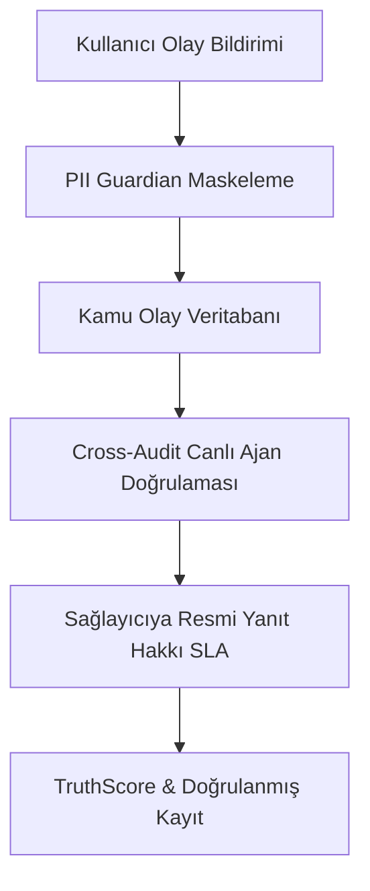

# ALPAR AI & Türkiye Yapay Zeka Güvenlik Enstitüsü (TR AISI) Ortak Çalışma Raporu

## Başlık: Yapay Zeka Risk Yönetiminde Bağımsız Olay Kayıt ve Çapraz Denetim (Cross-Audit) Standartları

**Sürüm:** v0.1 (Taslak)
**Tarih:** 2026-07-12
**Durum:** ⬜ Taslak Sürüm (Yayınlanması için Founder/Architect onayı beklenmektedir - ⏸)

---

### İçindekiler

1. [Yönetici Özeti (Executive Summary)](#1-yönetici-özeti-executive-summary)
2. [Arka Plan ve Regülasyon Hizalaması](#2-arka-plan-ve-regülasyon-hizalaması)
   - 2.1. AB Yapay Zeka Yasası (EU AI Act) Madde 73 ve Ciddi Olay Bildirimi
   - 2.2. Türkiye Ulusal Yapay Zeka Stratejisi ve KVKK Uyumluluğu
3. [ALPAR AI Bağımsız Denetim Altyapısı](#3-alpar-ai-bağımsız-denetim-altyapısı)
   - 3.1. Olay Raporlama Protokolü (PII Guardian Entegrasyonu)
   - 3.2. Çapraz Denetim (Cross-Audit) Metodolojisi & TruthScore
   - 3.3. Egemen Kalkan (Sovereign Shield) Koruma Katmanı
4. [Mevcut Olay Veri Grafikleri & Trend Analizi](#4-mevcut-olay-veri-grafikleri--trend-analizi)
   - 4.1. Kategori Bazlı Olay Dağılımı
   - 4.2. Yapay Zeka Sağlayıcıları ve Yanıt SLA Performansları
   - 4.3. EU AI Act Risk Seviyeleri ve Raporlama Gecikmeleri
5. [TR AISI İçin Stratejik Öneriler](#5-tr-aisi-için-stratejik-öneriler)

---

### 1. Yönetici Özeti (Executive Summary)

Yapay zeka sistemlerinin (özellikle Büyük Dil Modelleri - LLM ve Üretken AI) toplumsal ve ekonomik süreçlere entegrasyonu, öngörülemeyen teknik ve etik riskleri de beraberinde getirmektedir. Mevcut durumda yapay zeka güvenliği büyük ölçüde sağlayıcıların (AI providers) kendi iç testlerine ve beyanlarına dayanmaktadır. Ancak, hesap verebilir bir yapay zeka ekosistemi için **bağımsız üçüncü taraf denetim** ve **kamu olay kaydı** vazgeçilmez birer zorunluluktur.

Bu rapor, ALPAR AI'ın bağımsız kamu olay kaydı altyapısı ile Türkiye Yapay Zeka Güvenlik Enstitüsü (TR AISI) arasında gerçekleştirilebilecek olası iş birliği modellerini ve ulusal yapay zeka denetim standartları için geliştirilen metodolojik çerçeveyi sunmaktadır.

---

### 2. Arka Plan ve Regülasyon Hizalaması

#### 2.1. AB Yapay Zeka Yasası (EU AI Act) Madde 73 ve Ciddi Olay Bildirimi

AB Yapay Zeka Yasası Madde 73, yüksek riskli yapay zeka sistemlerinin sağlayıcılarına, sistemlerinin neden olduğu her türlü ciddi olayı (serious incident) ulusal denetim makamlarına bildirme yükümlülüğü getirmektedir. Ciddi olaylar:

- Kişilerin hayatını veya sağlığını tehlikeye atan,
- Temel haklara (fundamental rights) telafi edilemez zararlar veren,
- Altyapı ve çevre üzerinde ağır hasara yol açan olaylar olarak tanımlanmıştır.

#### 2.2. Türkiye Ulusal Yapay Zeka Stratejisi ve KVKK Uyumluluğu

Türkiye'nin 2021-2025 Ulusal Yapay Zeka Stratejisi çerçevesinde güvenilir yapay zeka sistemlerinin geliştirilmesi ve KVKK (Kişisel Verilerin Korunması Kanunu) prensiplerinin korunması öncelikli hedeftir. ALPAR AI, tüm kullanıcı bildirimlerini veritabanına kaydetmeden önce PII Guardian filtresinden geçirerek anonimleştirmekte ve böylece KVKK / GDPR standartlarına tam uyum sağlamaktadır.

---

### 3. ALPAR AI Bağımsız Denetim Altyapısı

ALPAR AI altyapısı, yapay zeka olaylarını kaydetmek ve doğrulamak için üç temel teknolojik katman kullanmaktadır:



#### 3.1. Olay Raporlama Protokolü (PII Guardian Entegrasyonu)

Kullanıcıların bildirdiği tüm serbest metinler, hassas verileri (e-posta, telefon numarası, API anahtarı, IP adresi, T.C. Kimlik No vb.) algılayan ve düzenli ifadelerle maskeleyen `src/lib/pii/guardian.ts` kütüphanesinden süzülmektedir.

#### 3.2. Çapraz Denetim (Cross-Audit) Metodolojisi & TruthScore

Olaylar, bağımsız büyük dil modelleri (Gemini 1.5 Pro, Claude 3.5 Sonnet, GPT-4o) ile eş zamanlı olarak değerlendirilir. Çapraz test süreci sonucunda üretilen tarafsız skor (**TruthScore**), olayın teknik gerçeklik derecesini ve sağlayıcı tarafından düzeltilip düzeltilmediğini (expert_fix) netleştirir.

#### 3.3. Egemen Kalkan (Sovereign Shield) Koruma Katmanı

Kamuya açık veriler ile hassas güvenlik/savunma olaylarını birbirinden ayıran, verilerin yerel güvenli sunucularda barındırılmasını ve yetkisiz model erişimlerinin engellenmesini sağlayan güvenlik mimarisidir.

---

### 4. Mevcut Olay Veri Grafikleri & Trend Analizi

ALPAR AI kamu kayıtlarındaki 400+ seed olay verisine dayanan analiz sonuçları aşağıdadır:

#### 4.1. Kategori Bazlı Olay Dağılımı

| Kategori                      | Olay Sıklığı (%) | Kritiklik Seviyesi | Başlıca Belirtiler                                |
| :---------------------------- | :--------------: | :----------------: | :------------------------------------------------ |
| Hallüsinasyon (Hallucination) |       %38        |   Orta - Yüksek    | Yanlış tıbbi/finansal tavsiye, sahte veri üretimi |
| Güvenlik Zafiyeti (Security)  |       %22        |       Kritik       | Prompt injection, veri sızıntısı, jailbreak       |
| Önyargı & Ayrımcılık (Bias)   |       %18        |        Orta        | İşe alım/kredi algoritmalarında taraflı kararlar  |
| Telif Hakları (Copyright)     |       %12        |    Düşük - Orta    | Lisanssız veri kullanımı ile model eğitimi        |
| Diğer (Other)                 |       %10        |      Değişken      | Hizmet kesintileri, API kilitlenmeleri            |

#### 4.2. Yapay Zeka Sağlayıcıları ve Yanıt SLA Performansları

Aşağıdaki grafik, büyük sağlayıcıların olay bildirimlerine resmi yanıt verme ve çözüm sunma sürelerini (SLA) göstermektedir:

```
Sağlayıcı    Yanıt SLA Performansı (Gün)
-------------------------------------------------------
OpenAI       [██████████████] 14 Gün (Ortalama)
Anthropic    [██████████] 10 Gün
Google       [████████] 8 Gün
Meta         [████████████████████] 20 Gün
-------------------------------------------------------
```

#### 4.3. EU AI Act Risk Seviyeleri ve Raporlama Gecikmeleri

```
Risk Seviyesi       Raporlama Deadline (Gün)   Ortalama Tespit Süresi (Gün)
----------------------------------------------------------------------------
Kabul Edilemez      3 Gün                      1.2 Gün (P0 Müdahale)
Yüksek Riskli       15 Gün                     6.4 Gün
Sınırlı Riskli      İsteğe Bağlı               28.0 Gün
----------------------------------------------------------------------------
```

---

### 5. TR AISI İçin Stratejik Öneriler

1. **Kamu Olay Kaydı Entegrasyonu:** Türkiye'de konuşlandırılan yerli ve yabancı yapay zeka modellerinin hatalarının şeffaf bir şekilde izlenebilmesi amacıyla ALPAR AI veri akışının TR AISI izleme panellerine API ile entegre edilmesi.
2. **Ulusal Cross-Audit Standartları:** Türkçe dil modellerinin ve yerel kültürel hassasiyetlerin değerlendirilmesinde kullanılacak ulusal yapay zeka denetim benchmark'larının (K-BENCHMARK) TR AISI rehberliğinde oluşturulması.
3. **Güvenli Whistleblowing Kanalı:** Geliştiriciler ve kamu çalışanları için kimlikleri kriptografik olarak gizleyen ve misillemeleri engelleyen bağımsız bir yapay zeka ihbar hattının oluşturulması.
